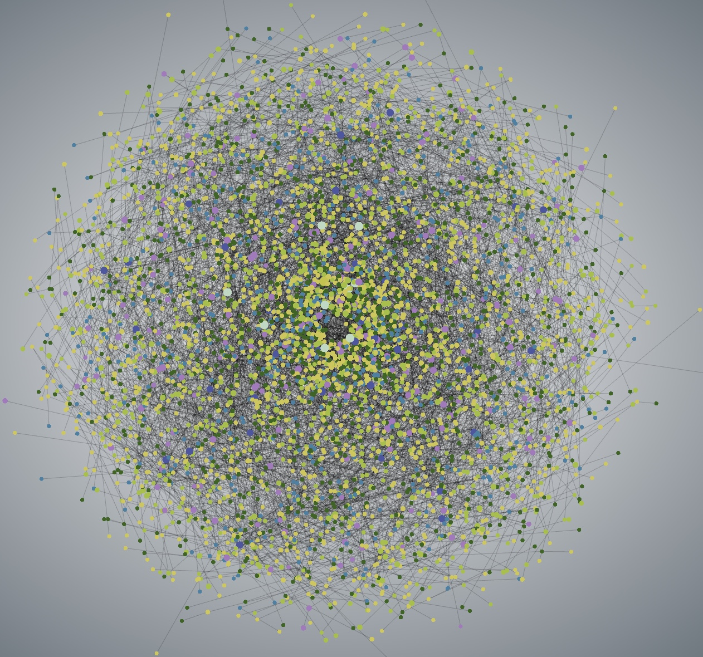

<p align="center">
  
</p>
<p align="center">
  
</p>

## About The Project
A data visualizer aims to support smooth interaction with big data.  

## Get Started
#### Run Online   
[https://data-visualizer-project.netlify.app](https://data-visualizer-project.netlify.app) 

#### Run locally
1. Clone the repo  
```
git clone git@github.com:Eric-Schecter/data-visualizer.git
```
2. Open Folder  
```
cd data-visualizer
```
3. Install npm packages  
```
npm install
```
4. Start app  
```
npm start
```
Then visit 'http://localhost:3000'

## License
This project is licensed under [](https://opensource.org/licenses/MIT)

## Contact
* Email:[eric199002@icloud.com](eric199002@icloud.com)
* Twitter:[https://twitter.com/nikoniko600](https://twitter.com/nikoniko600)
* Repo:[https://github.com/Eric-Schecter/data-visualizer](https://github.com/Eric-Schecter/data-visualizer)
* App:[https://data-visualizer-project.netlify.app](https://data-visualizer-project.netlify.app) 