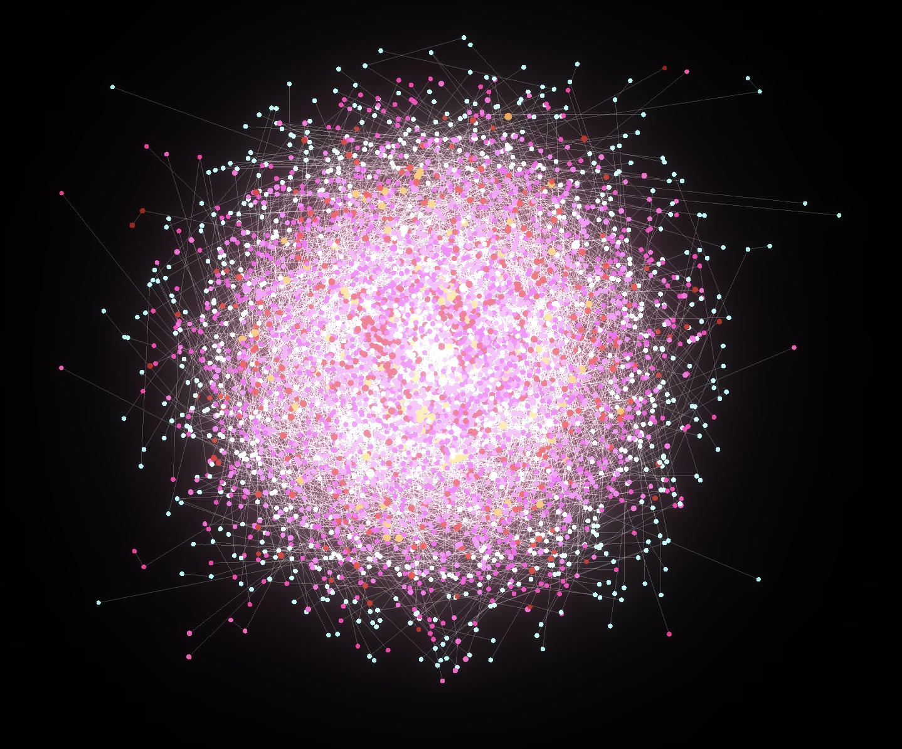

<p align="center">
  
</p>
<p align="center">
  
</p>

## About The Project
The project aims to find out the way of supporting smooth interaction with big data.  
The project is trying to get the best performance by handling logic in shader as much as possible.  
Todo: optimize collision check algorithm in compute shader.  

## Get Started
#### Run Online   
[https://webgl-performance-test.netlify.app](https://webgl-performance-test.netlify.app) 

#### Run locally
1. Clone the repo  
```
git clone git@github.com:Eric-Schecter/webgl-performance-test.git
```
2. Open Folder  
```
cd webgl-performance-test
```
3. Install npm packages  
```
npm install
```
4. Start app  
```
npm start
```
Then visit 'http://localhost:3000'

## License
This project is licensed under [](https://opensource.org/licenses/MIT)

## Contact
* Email:[eric199002@icloud.com](eric199002@icloud.com)
* Twitter:[https://twitter.com/nikoniko600](https://twitter.com/nikoniko600)
* Repo:[https://github.com/Eric-Schecter/webgl-performance-test](https://github.com/Eric-Schecter/webgl-performance-test)
* App:[https://webgl-performance-test.netlify.app](https://webgl-performance-test.netlify.app) 